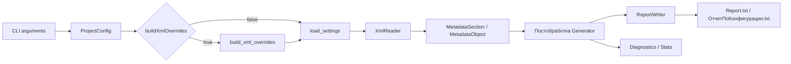

# Архитектура

Проект построен как небольшой Python-пакет без внешних зависимостей. Основная идея: держать знания о версиях платформы, именах XML-элементов, переводах и порядке вывода в настройках, а Python-код использовать для общего обхода XML, извлечения сложных значений и записи отчета.

## Поток Данных

Простой режим отличается только способом создания `ProjectConfig` и местом хранения XML-derived overrides. Дальше он использует тот же конвейер, что и JSON-конфиг.

## Основные Модули

| Модуль | Ответственность |
| --- | --- |
| `generate_config_report.cli` | разбор аргументов, simple/config mode, logging, запуск generator |
| `generate_config_report.config` | dataclass `ProjectConfig`, чтение и валидация JSON-конфига |
| `generate_config_report.settings` | загрузка `defaults.json`, deep merge overlay, построение typed settings |
| `generate_config_report.object_registry` | описания типов объектов и дочерних коллекций |
| `generate_config_report.metadata_model` | внутренняя модель отчета: object, section, property |
| `generate_config_report.xml_reader` | чтение XML-выгрузки и построение дерева объектов метаданных |
| `generate_config_report.property_extractors` | извлечение, нормализация и форматирование XML-свойств |
| `generate_config_report.generator` | orchestration, проверки источников, наследование расширений, diagnostics, exit codes |
| `generate_config_report.report_writer` | запись текстового отчета в нужном формате |
| `generate_config_report.diagnostics` | события диагностики, агрегация warnings, stats |
| `generate_config_report.build_xml_overrides` | анализ XML и генерация overlay-настроек |

## Модель Отчета

Внутренняя модель минимальна:

- `MetadataSection` - корневой раздел, обычно `main` или `extension`.
- `MetadataObject` - объект метаданных с `full_name`, `type_key`, `name`, списком свойств и дочерних объектов.
- `ReportProperty` - свойство отчета. Поддерживает scalar, marker, list, object list и named object list.

`ReportWriter` не знает о 1C XML. Он получает уже подготовленную модель и отвечает только за форматирование дерева.

## Чтение XML

`XmlReader` работает по настройкам из `GeneratorSettings`:

- ищет корневой файл `Configuration.xml`;
- определяет payload внутри `MetaDataObject`;
- читает свойства через whitelist конкретного типа объекта;
- читает дочерние коллекции из настроек;
- поддерживает специальные вложенные файлы, например `Form.xml`, `Template.xml`, `Command.xml`;
- сохраняет порядок объектов по reference order, когда он доступен в XML;
- дедуплицирует повторно найденные объекты.

Типы объектов, имена папок, XML element names, plural names и дочерние коллекции описаны в `settings/defaults.json`.

## Извлечение Свойств

`property_extractors.py` закрывает различия между XML-представлением платформы и текстовым отчетом:

- алиасы имен свойств, включая русские и английские XML-имена;
- localized strings;
- списки и многострочные значения;
- ссылки на метаданные;
- описания типов 1C;
- параметры выбора;
- стандартные реквизиты;
- характеристики;
- подавление шумных пустых значений;
- перевод enum-значений платформы.

Если свойство можно описать alias, whitelist, translation или default-правилом, его стоит добавлять в `defaults.json`. Python extractor лучше менять только для структурных XML-форматов, которые нельзя выразить настройками.

## Подход От Настроек

Универсальность проекта держится на том, что большинство различий вынесено в `defaults.json`:

- `propertyAliases` сопоставляет имя в отчете с возможными XML-именами;
- `valueTranslations`, `valuePrefixTranslations`, `valueSegmentTranslations` переводят платформенные значения;
- `blockedPropertyNames`, `blockedPropertyFragments`, `blockedOutputPropertyNames` фильтруют служебный шум;
- `objectTypes` задает поддержанные верхнеуровневые типы метаданных;
- `childCollections` задает вложенные коллекции;
- `configurationWhitelist` и object whitelists задают порядок и состав вывода.

Overlay-файл позволяет точечно переопределить defaults для конкретной платформы или проекта. Словари сливаются рекурсивно, массивы заменяются целиком.

## Обработка Расширений

Если в config задано расширение, генератор читает основную конфигурацию и расширение как отдельные `MetadataSection`.

После чтения `_apply_extension_inheritance`:

- находит объекты расширения, принятые из расширяемой конфигурации;
- применяет synthetic defaults из settings;
- наследует выбранные свойства из основного объекта;
- подавляет или очищает отдельные marker/scalar свойства по правилам settings.

Это поведение нужно для приближения отчета расширения к тому, как его показывает конфигуратор.

## Диагностика

Диагностика собирается независимо от записи отчета. Generator может завершиться ошибочным кодом, но при наличии `diagnosticsPath` все равно попробует записать:

- `report-diagnostics.json`;
- `report-stats.json`.

Warnings по unsupported complex property и unsupported type агрегируются. Это важно для больших конфигураций, где одна и та же неподдержанная структура может встречаться тысячи раз.

## Запись Отчета

`ReportWriter` формирует текстовый файл из готовой модели:

- корневой отступ: один tab;
- переносы строк: CRLF;
- кодировка: UTF-16 с BOM по defaults;
- между main и extension добавляется пустая строка;
- scalar property пишется как `Имя: "Значение"`;
- list property пишется блоком quoted values;
- marker property пишется отдельной строкой.

`Generator._write_report` пишет отчет через временный файл и атомарную замену целевого файла.

## Границы Ответственности

Код не должен содержать project-specific hardcode для одной конфигурации. Если отличие можно выразить настройками, оно должно жить в settings overlay или в `defaults.json`.

Допустимые причины менять Python-код:

- новый XML-формат свойства требует парсинга структуры, а не простого alias;
- нужно поддержать новый kind внутреннего свойства отчета;
- нужно изменить общий порядок обхода или постобработки;
- нужно добавить диагностику для класса ошибок, который нельзя увидеть на уровне settings.

Для остальных случаев предпочтительны настройки и тесты.
